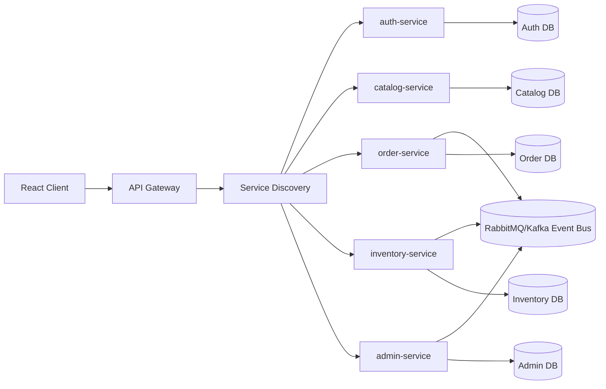
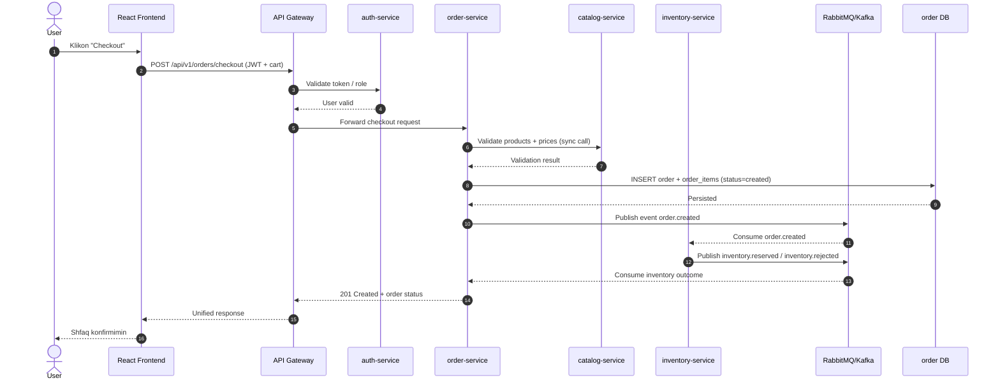
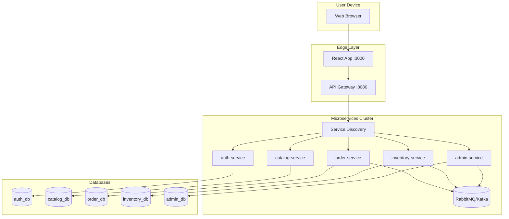
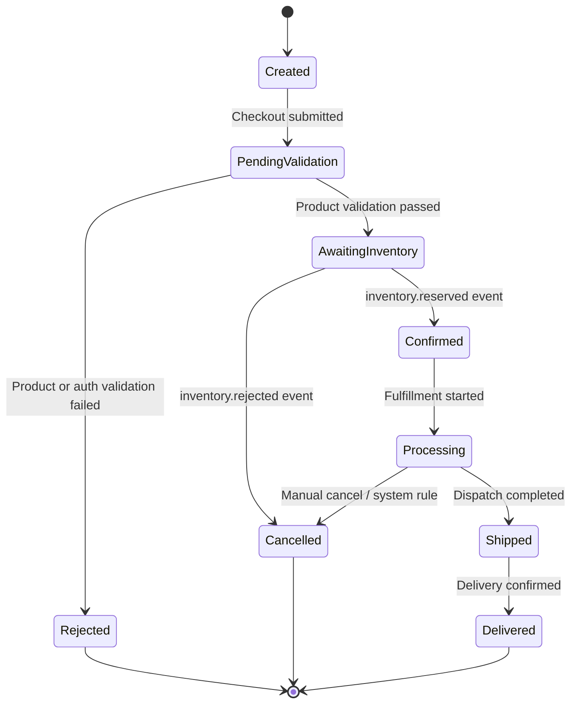

# Diagramat Mbeshtetese te Modelit

Ky dokument permbledh diagramat kryesore te kerkuara per pershkrimin e modelit te sistemit MobileShop ne arkitekture microservices.

## 1) Component Diagram

## 2) Sequence Diagram per API Calls (Checkout Flow)

## 3) Deployment Diagram

## 4) State Diagram per Entitet Dinamik (Order)

## Shenime

- Diagramat jane te shkruara ne `mermaid`, prandaj mund te renderohen direkt ne shumicen e IDE-ve dhe platformave te dokumentimit.
- Keto versione jane te pershtatura per modelin microservices me `Gateway`, `Service Discovery`, `Event Bus`, dhe `database-per-service`.
