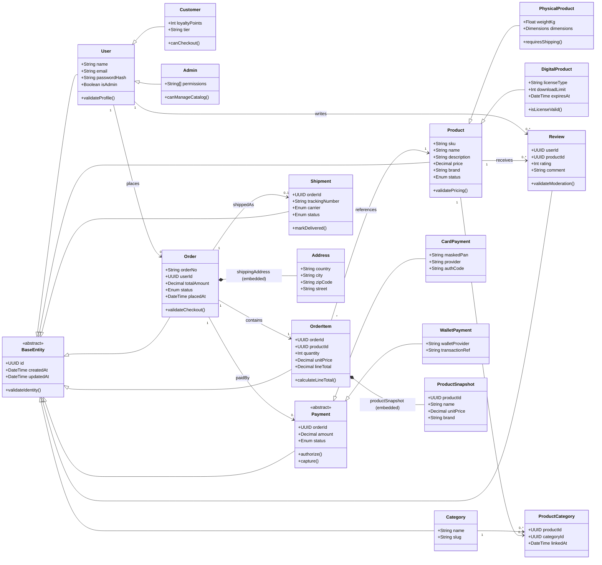

# Entity Modeli i Avancuar (UML + Business Rules)

Ky dokument formalizon modelin e entiteteve per `MobileShop` me fokus te:
- Inheritance dhe Polymorphism
- Entitete abstrakte
- Relacione komplekse `1:N` dhe `N:N`
- Embedded entities per NoSQL (ku aplikohet)
- Validime te avancuara ne nivel modeli dhe biznesi

## 1) UML Class Diagram (Mermaid)

## 2) Relacione kryesore

- `User (1) -> (N) Order`
- `Order (1) -> (N) OrderItem`
- `Product (N) <-> (N) Category` permes `ProductCategory`
- `Order (1) -> (N) Payment` (nje porosi mund te kete tentative te shumta pagese)
- `Order (1) -> (0..1) Shipment`
- `User (1) -> (N) Review` dhe `Product (1) -> (N) Review`

## 3) Inheritance dhe Polymorphism

- `User` eshte baze e specializimeve `Customer` dhe `Admin`.
- `Product` polimorfik: `PhysicalProduct` dhe `DigitalProduct`.
- `Payment` entitet abstrakt me implementime `CardPayment` dhe `WalletPayment`.
- Ne biznes, `authorize()/capture()` thirren polimorfikisht sipas tipit te pageses.

## 4) Embedded Entities (NoSQL-ready)

Edhe nese storage kryesor eshte SQL, keto fusha duhen modeluar si embedded-value-objects:

- `Order.shippingAddress` si objekt i ngulitur `Address`
- `OrderItem.productSnapshot` si objekt i ngulitur `ProductSnapshot`

Kjo siguron:
- historik korrekt te porosise edhe nese `Product` ndryshon me vone
- decoupling nga katalogu ne event-driven workflows

## 5) Validime te avancuara (Model + Business)

### Model-level

- `User.email` duhet te jete unik dhe ne format valid.
- `User.passwordHash` nuk ruhet kurre ne plain text.
- `Product.sku` unik; `price > 0`; `status in {ACTIVE, DRAFT, DISCONTINUED}`.
- `OrderItem.quantity >= 1`; `unitPrice >= 0`; `lineTotal = quantity * unitPrice`.
- `Review.rating in [1..5]`; nje user mund te kete vetem nje review per produkt.
- `Address` kerkon `country`, `city`, `street`; `zipCode` me regex sipas shtetit.

### Business-level

- Checkout lejohet vetem nese:
  - ka te pakten 1 `OrderItem`
  - stock mjafton per secilin item
  - cmimi i item-it sinkronizohet me `catalog` ose snapshot i validuar
- `Order.totalAmount` duhet te barazohet me shumen e `OrderItem.lineTotal`.
- Tranzicionet e statusit:
  - `CREATED -> PENDING_PAYMENT -> PAID -> SHIPPED -> DELIVERED`
  - `CREATED|PENDING_PAYMENT -> CANCELLED`
  - tranzicione te tjera refuzohen.
- `Payment.capture()` lejohet vetem pasi `authorize()` ka sukses.
- `Shipment` krijohet vetem per `PhysicalProduct`.
- `DigitalProduct` dorzohet me license/token dhe nuk krijon shipment fizik.

## 6) Si mapehet ne databaze

- SQL tables kryesore: `users`, `products`, `categories`, `product_categories`, `orders`, `order_items`, `payments`, `shipments`, `reviews`
- JSON columns (ose dokumente NoSQL per service te vecanta):
  - `orders.shipping_address`
  - `order_items.product_snapshot`

## 7) Integrim me arkitekturen microservices

- `catalog-service`: `Product`, `Category`, `Review`
- `order-service`: `Order`, `OrderItem`, `Payment`, `Shipment`
- `auth-service`: `User`, `Customer`, `Admin`
- Evente tipike:
  - `order.created`
  - `payment.authorized`
  - `payment.captured`
  - `inventory.reserved`
  - `order.shipped`

