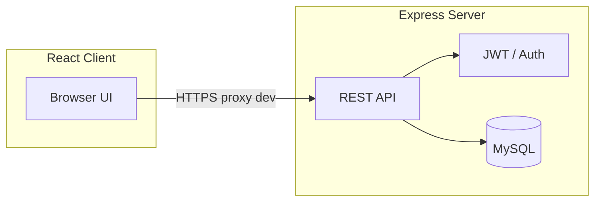

# Dokumentacion teknik — MobileShop

Ky dokument është për **zhvillues** dhe **administratorë teknikë**. Për API me shembuj të plotë shihni edhe [API_Reference.md](./API_Reference.md).

---

## 1. Përmbledhje e sistemit

MobileShop është një aplikacion **dyqan online** me:

- **Backend:** Node.js, framework **Express**, lidhje me **MySQL** përmes driver-it `mysql2`, autentifikim **JWT** dhe opsione sigurie (Helmet, sanitizim, kufizim kërkesash).
- **Frontend:** **React** (Create React App), **React Router**, **Material UI**, **Redux Toolkit**, komunikim me API përmes **Axios** dhe **proxy** drejt backend-it.
- **Dokumentacion API:** specifikim **OpenAPI 3** i shërbyer nga **Swagger UI** në rrugën `/docs`.

Ekziston gjithashtu një arkitekturë **opsionale mikrosherbimesh** (`docker-compose.microservices.yml`, shërbime `services/*`, gateway) për skenarë më të avancuar; zhvillimi i përditshëm monolit mund të bëhet vetëm me `server` + `client` + MySQL.

---

## 2. Struktura e repozitorit (nivel i lartë)

```
mobile-shop/
├── client/                 # React SPA
│   ├── src/
│   │   ├── pages/          # Faqe (Home, Login, Admin, …)
│   │   ├── components/     # UI të ripërdorshme
│   │   ├── auth/           # Kontekst autentifikimi
│   │   ├── routes/         # RequireAuth, RequireRole
│   │   └── setupProxy.js   # Proxy drejt HTTPS të backend-it
│   └── cypress/            # Teste E2E
├── server/                 # API monolit
│   ├── app.js              # Konfigurim Express, rrugë, middleware
│   ├── server.js           # Nisje HTTP (redirect) + HTTPS
│   ├── routes/             # Rrugë REST (auth, products, orders, …)
│   ├── models/             # Qasje në bazë të dhënash
│   ├── middleware/         # auth, security, rateLimit, audit, …
│   ├── modules/            # Module të organizuara (authentication, …)
│   ├── config/             # db, https
│   ├── docs/               # openapi.js, dokumente module
│   └── schema.sql          # Skema MySQL referuese
├── tests/                  # Newman, Locust, Postman
├── services/               # Mikrosherbime (opsionale)
├── gateway/                # API Gateway (opsionale)
└── .env                    # Variabla mjedisi (jo në git në prodhim)
```

---

## 3. Modulet e serverit (`server/modules/`)

Modulet janë të regjistruara në `server/modules/registry.js` dhe montuar në `app.js` me `basePath` dhe `legacyPath` ku përket.

| Moduli | `basePath` | Përshkrim i shkurtër |
|--------|------------|----------------------|
| **authentication** | `/api/v1/auth` (+ legacy `/auth`) | Regjistrim, hyrje, JWT/refresh, OAuth2-style token, 2FA, rivendosje fjalëkalimi, `/me`. Implementim kryesor: `server/routes/auth.js`. |
| **user-management** | `/api/v1/users` | Lista/krijim përdoruesish (admin), profil sipas ID, audit logs — `server/modules/user-management/index.js`. |
| **business-operations** | `/api/v1/business` | Monton nën-modul produkte dhe porosi: `/api/v1/business/products`, `/api/v1/business/orders`. **Shënim:** të njëjtat rrugë ekzistojnë edhe në version të versionuar drejtpërdrejt në `app.js` (`/api/v1/products`, `/api/v1/orders`) për përputhshmëri. |
| **statistics-reporting** | `/api/v1/stats` | Përmbledhje admin (`/overview`, `/reports/sales-by-day`, `/monitoring/modules`). |

Lista e moduleve të ekspozuar publikisht (meta): `GET /api/v1/modules`.

Dokumentacion për modul specifik (Markdown): `GET /docs/modules/:moduleName` (skedarë në `server/docs/modules/`).

---

## 4. Arkitektura teknike

### 4.1 Back-end

- **Hyrja:** `server.js` ngarkon `.env` nga `mobile-shop/.env`, nis **HTTP** në `PORT` (ridrejtim 301 drejt HTTPS) dhe **HTTPS** në `HTTPS_PORT` me certifikata nga `server/config/https.js` (mund të gjenerohen me `npm run ssl:generate` në dosjen `server`).
- **Aplikacioni:** `app.js` — CORS, JSON body, middleware sigurie (`sanitizeInput`, `sqlInjectionProtection`, `outputEncodingMiddleware`), `helmet`, rate limit për `/api`, rrugë versioni `v1`, rrugë legacy pa version.
- **Autentifikim:** JWT në header `Authorization: Bearer <token>`; refresh token ruhet në DB (hash); verifikim me `middleware/auth.js` (`requireAuth`, `requireAdmin`).
- **Vëzhgim:** `express-status-monitor` në `/status` (mbrojtje në prodhim sipas politikës suaj).

### 4.2 Front-end

- **Build:** CRA (`react-scripts`). `npm start` — zakonisht `http://localhost:3000`.
- **Proxy:** `client/src/setupProxy.js` ridërgon `/api`, `/auth`, `/docs`, `/products`, `/orders`, etj. drejt `https://localhost:3444` (me `secure: false` për certifikata vetë- nënshkruar në dev).
- **Rrugët UI:** përcaktohen në `client/src/App.js` (`/`, `/login`, `/signup`, `/orders`, `/admin`, `/manager`, `/dashboard`, …).
- **Rolet në UI:** `RequireRole` përdor `hasRoleAccess` (`client/src/utils/roles.js`) — përshtatet me fushat e kthyer nga API (p.sh. `is_admin`, `roles`).

### 4.3 Baza e të dhënave

- **Motorri:** MySQL 8.x (rekomanduar).
- **Skema:** `server/schema.sql` — tabela kryesore: `users`, `products`, `orders`, `order_items`, `categories`, `reviews`, `payments`, `shipments`, `user_action_tokens`, `refresh_tokens`, `audit_logs`, etj.
- **Lidhja:** `server/config/db.js` — parametrat nga variablat `DB_HOST`, `DB_PORT`, `DB_USER`, `DB_PASSWORD`, `DB_NAME` në `.env`.

### 4.4 Diagram i përgjithshëm (monolit dev)



---

## 5. Referencë e shpejtë për skedarë kyç

| Nevoja | Skedar |
|--------|--------|
| Rrugë produktesh | `server/routes/products.js` |
| Rrugë porosish | `server/routes/orders.js` |
| Rrugë autentifikimi | `server/routes/auth.js` |
| Validim / XSS / SQLi middleware | `server/middleware/security.js` |
| OpenAPI | `server/docs/openapi.js` |
| Skema DB | `server/schema.sql` |

---

## 6. Lidhje me dokumente të tjera

- [Instalim_dhe_Deployment.md](./Instalim_dhe_Deployment.md) — mjedis lokal dhe prodhim.
- [Mirembajtje_dhe_Versionim.md](./Mirembajtje_dhe_Versionim.md) — backup dhe përditësime.
- [API_Reference.md](./API_Reference.md) — endpoint-e dhe shembuj request/response.

---

_Dokumenti përputhet me gjendjen e përgjithshme të kodit në `mobile-shop`. Për ndryshime të veçanta të degës suaj, përditësoni versionin dhe datën në krye të këtij dokumenti._
